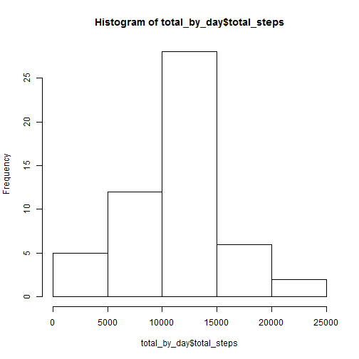
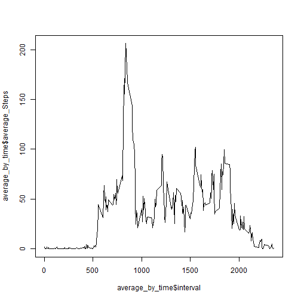
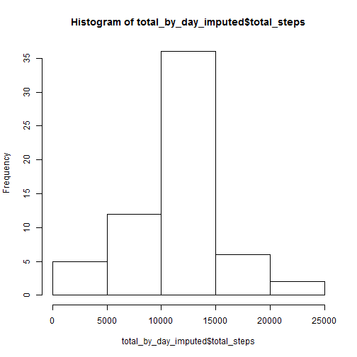

First, set the working directory, and as I intend to use SQL for the summarisation required for this assignment, load the library sqldf.  


```r
setwd("C:/Users/Martin/Documents/stats/Coursera RR")
activity<-read.csv("activity.csv")
library(sqldf)
```

Now we will work out the daily total number of steps and put this into a table called total_by_day, then plot a histogram.  Note that SQLDF recognises "NA" as null values.


```r
total_by_day<-sqldf('select date, sum(steps) as total_steps from activity where steps is not null group by date')
hist(total_by_day$total_steps)
```

 

Time to get the simple mean and median values:

```r
mean(total_by_day$total_steps)
```

```
## [1] 10766.19
```

```r
median(total_by_day$total_steps)
```

```
## [1] 10765
```

Now the time series plot, with average steps by time (ie interval).  Again I will use SQL to derive the averages:


```r
average_by_time<-sqldf('select interval, avg(steps) as average_Steps from activity where steps is not null group by interval')
plot(average_by_time$interval, average_by_time$average_Steps, type="l")
```

 

Find the time with the most steps

```r
average_by_time[which.max(average_by_time$average_Steps),1]
```

```
## [1] 835
```
encouragingly, this looks like it matches the chart pretty well!

ok, now looking at missing values.  First, how many are there?

```r
sum(is.na(activity$steps))
```

```
## [1] 2304
```

I will impute missing values by taking the mean of the average by time (interval).  Since I calculated that and put it in average_by_time earlier, using SQL again I can just join this to the activity data, and use a case statement to take the imputed value where necessary.


```r
imputed_activity<-sqldf('select a.interval, a.date, case when a.steps is null then t.average_steps else a.steps end as imputed_steps from activity a inner join average_by_time t on a.interval = t.interval')
```

Now repeat the histogram and mean/median calculations from before.


```r
total_by_day_imputed<-sqldf('select date, sum(imputed_steps) as total_steps from imputed_activity group by date')
hist(total_by_day_imputed$total_steps)
```

 

```r
mean(total_by_day_imputed$total_steps)
```

```
## [1] 10766.19
```

```r
median(total_by_day_imputed$total_steps)
```

```
## [1] 10766.19
```

This has made a difference to the histogram, as we can see that the 10000-15000 step bucket has increased in frequency significantly.  The mean remains unchanged and the median is now the same as the mean.

Right, I know there is one section of the assignment still to go, but I am running low on time so I am going to upload this as it is currently, to ensure I have most of the assignment locked down.  If I have time I will then return and do the final section.
